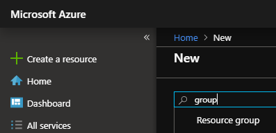
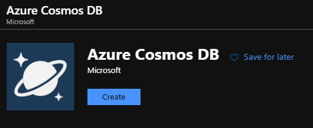
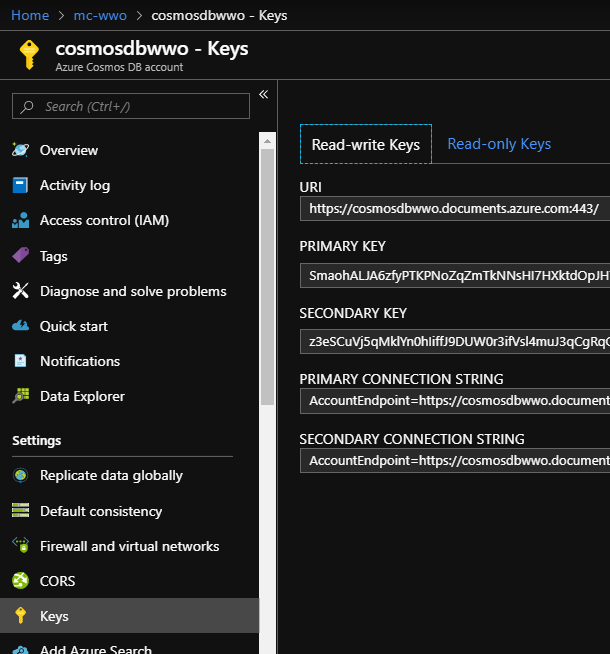
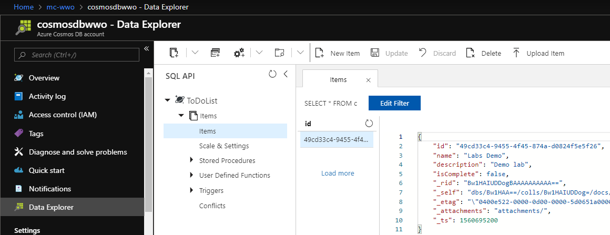
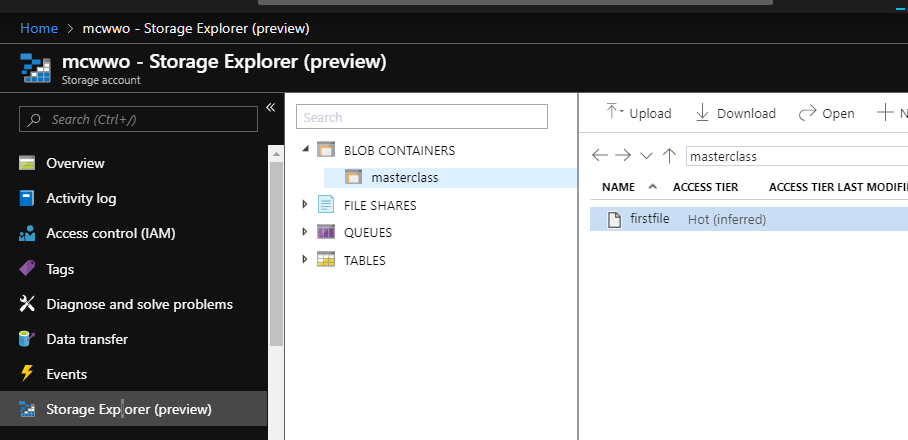
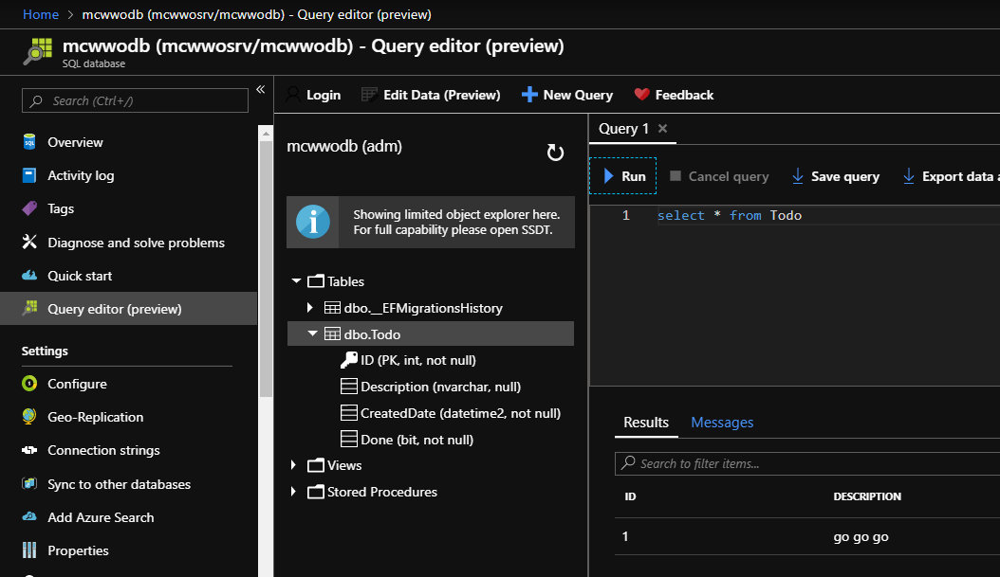

# Azure Data

## Objectifs

Cet atelier montre comment mettre plusieurs services Azure Data au sein d'une application .Net Core dans App Service.

Vous devez réaliser cet atelier localement depuis votre poste.

## Déployer la Web App

Dans le portail Azure, commencez par créer un Resource Group en cliquant sur `Create a resource` puis en choisissant `Resource group`.

Pour ce lab, nous utiliserons l'application suivante : [Labs Intro Azure Data](https://github.com/wilfriedwoivre/labs-intro-azure-data)

Pour déployer, appuyez sur le bouton suivant et suivez les instructions

Le déploiement prend environ 2min, vous pourrez retrouver les éléments suivants dans votre Resource Group :

- Azure App Service Plan : Linux / SKU B1
- Azure Web App : .Net Core 2.2 configuré via deployment center avec un git distant

## Accéder à l’application

Pour accéder à l’application déployée à l’aide de votre navigateur web, vous devrez vous rendre à l'adresse `https://<app_name>.azurewebsites.net`. Remplacez simplement <app_name> par le nom de votre application.

## Cosmos DB

### Créer une instance CosmosDB

Dans votre Resource Group, créez un Cosmos DB en cliquand sur le bouton `Add` puis en choisissant `Cosmos DB`

Cliquez enfin sur le bouton `Create`.

Choisissez un nom de compte unique.
Pour le champ `API`, choisissez `Core (SQL)`.

Pour les options `Geo-Redondancy` et `Multi-region Writes` choisissez `Disable`

Validez le formulaire avec le bouton `Review and create`, puis appuyez sur le bouton `Create`.

### Récupérer les informations de connexion

Dans votre Cosmos DB, allez récupérer vos clés dans l'interface suivante :

Copiez les éléments suivants dans un notepad

- URI
- Primary Key

### Configurer votre Web App

Dans votre Web App, dans la blade `Configuration`

Ajoutez les éléments suivants en tant que `New Application Setting`

- CosmosDB__endpoint : `Votre URI récupéré précédemment`
- CosmosDB__key : `Votre Primary Key récupéré précédemment`

Sauvegardez vos nouvelles configuration, et rafraichissez votre application Web afin de pouvoir essayer l'onglet CosmosDB

### Consulter vos données

Après avoir créé un ou pluseurs éléments depuis le site de lab. Vous pouvez les consulter via la blade `Data Explorer` de votre Cosmos DB

## Storage Account

### Créez un compte de stockage

Dans votre Resource Group, créez un Storage Account en cliquand sur le bouton `Add` puis en choisissant `Storage Account`

Cliquez enfin sur le bouton `Create`.

Choisissez un nom de compte unique.
Pour le champ `Replication`, choisissez `Locally-redundant storage (LRS)`.

Validez le formulaire avec le bouton `Review and create`, puis appuyez sur le bouton `Create`.

### Récupérer les informations de connexion

Dans votre Storage Account, allez récupérer vos clés dans l'interface suivante :

Copiez les éléments suivants dans un notepad

- Storage Account Name
- Key1

### Configurer votre Web App

Dans votre Web App, dans la blade `Configuration`

Ajoutez les éléments suivants en tant que `New Application Setting`

- Storage__accountName : `Votre Storage Account Name récupéré précédemment`
- Storage__accountKey : `Votre Key1 récupéré précédemment`

Sauvegardez vos nouvelles configuration, et rafraichissez votre application Web afin de pouvoir essayer l'onglet Storage Blob

### Consulter vos données

Après avoir créé un ou pluseurs éléments depuis le site de lab. Vous pouvez les consulter via la blade `Storage Explorer (preview)` de votre Storage Blob

## SQL

### Créez un compte SQL Database

Dans votre Resource Group, créez un SQL Database en cliquand sur le bouton `Add` puis en choisissant `SQL`

Cliquez enfin sur le bouton `Create`.

Choisissez un nom de base unique.
Créez un nouveau serveur. 

Pour la partie `Compute+Storage` choisissez Basic comme ci-dessous :

Validez le formulaire avec le bouton `Review and create`, puis appuyez sur le bouton `Create`.

### Récupérer les informations de connexion

Dans votre Storage Account, allez récupérer votre chaine de connexion dans l'interface suivante :

N'oubliez pas de remplacer les champs `your_login` et `your_password`

### Configurer votre Web App

Dans votre Web App, dans la blade `Configuration`

Ajoutez les éléments suivants en tant que `New Connection String`

- DbConnection : `Votre connection string récupéré précédemment`
- Type : SQL Azure

Sauvegardez vos nouvelles configuration, et rafraichissez votre application Web afin de pouvoir essayer l'onglet SQL Database

### Consulter vos données

Après avoir créé un ou pluseurs éléments depuis le site de lab. Vous pouvez les consulter via la blade `Query Editor (preview)` de votre SQL Database

## Supprimer des ressources

Au cours des étapes précédentes, vous avez créé des ressources Azure au sein d’un groupe de ressources. Si vous ne pensez pas avoir besoin de ces ressources à l’avenir, supprimez le groupe de ressources.

L’exécution de cette action peut prendre plusieurs minutes.
