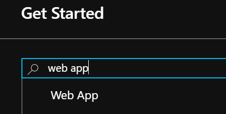

# Web App et Git

## Objectifs

Cet atelier montre comment déployer une application Node.js dans App Service à l’aide de [Cloud Shell](https://docs.microsoft.com/azure/cloud-shell/overview) et du logiciel de gestion de versions décentralisé [Git](https://fr.wikipedia.org/wiki/Git).

Vous devez réaliser cet atelier localement depuis votre poste.

## Créer une web app

Dans le portail Azure, commencez par créer un Resource Group en cliquant sur `Create a resource` puis en choisissant `Resource group`.


Dans la blade de dgauche cliquez sur `Resource groups` puis sélectionnez le groupe nouvellement créé.

Dans ce Resource Group, créez une Web App en cliquant sur le bouton `Add` puis en choisissant `web app`.




Cliquez enfin sur le bouton `Create`.


Choisissez un nom d'app unique.
Pour le champ `runtime stack`, choisissez `Node LTS` (dernière version disponible).

Validez le formulaire avec le bouton `Review and create`.

## Accéder à l’application

Pour accéder à l’application déployée à l’aide de votre navigateur web, vous devrez vous rendre à l'adresse `https://<app_name>.azurewebsites.net`. Remplacez simplement <app_name> par le nom de votre application.

## Activer Git via le Deployment Center

Depuis le portail, cliquez sur `Resource groups`, sélectionnez votre groupe puis l'application web App Service que vous venez de créer.
Dans la page qui s'ouvre sélectionnez `Deployment center`, `Local Git` et validez le formulaire.


Il se peut que Azure vous demande de renseigner des credentials Git que vous utiliserez plus tard.

Une fois le repository Git créé, revenez sur l'onglet `Overview` de votre App Service et vous devriez voir l'adresse du nouveau repository.

## Cloner le code

Ouvrez votre invite de commande, créez un répertoire temporaire et placez le shell dans ce nouveau répertoire.

```bash
mkdir azdev-webapp-git

cd azdev-webapp-git
```

Clonez ensuite le référentiel de l’exemple dans votre répertoire avec la commande suivante.

```bash
git clone https://github.com/michaelfery/react-shopping-cart
```

Placez le shell dans ce nouveau répertoire.

```bash
cd react-shopping-cart
```

Si vous souhaitez tester l'application, vous devrez avoir installé node et lancer les commandes suivantes:

```bash
npm install

npm start
```

Pour Azure, aucun besoin d'avoir node en local, ni même de tester votre code. Il vous suffit de déployer votre coe source pour que les commandes soient lancées à votre place.

# Déployer l'application via Git

Nous allons désormais ajouter la référence au nouveau repository de code. Pour cela, éxécutez les commandes suivantes en remplaçant `<git clone url>` par l'adresse de votre repository:

```bash
git remote add azure <git clone url>
```

```bash
git remote -v
```

Cette commande vous affiche la liste des `origins` définies. Voici ce que vous devriez voir:

```bash
azure   <git clone url> (fetch)
azure   <git clone url> (push)
origin  https://github.com/michaelfery/react-shopping-cart (fetch)
origin  https://github.com/michaelfery/react-shopping-cart (push)
```

Si vous partez d'un repertoire complètement neuf vous devez créer le repository en local puis l'associer au repository distant.
Pour cela, éxécutez les commandes suivantes en remplaçant `<git clone url>` par l'adresse de votre repository:

```bash
git init
git add .
git commit -m "Initial Commit"
git remote add azure <git clone url>
git push azure master
```


Exécutez ensuite les commandes suivantes en remplaçant `<git clone url>` par l'adresse de votre repository.

```bash
git push azure master
```

Une fois le déploiement terminé, revenez à la fenêtre du navigateur que vous avez ouverte à l’étape **Accéder à l’application**, puis actualisez la page.

L’exemple de code React s’exécute dans App Service sur Linux avec une image intégrée.


**Félicitations !** Vous avez déployé votre première application React sur App Service sur Linux.

## Mettre à jour et redéployer le code

Dans votre invite de commande, tapez `code /src/index.css` pour ouvrir l’éditeur de code.

 Apportez une petite modification à la feuille de style en ajoutant le code suivant :

```css
nav {
    background-color: #0663D7;
}
```

Enregistrez vos modifications et quittez code.

Vous allez maintenant redéployer l’application.

```bash
git add .
git commit -m 'fix nav css to azure'
git push azure master
```

Une fois le déploiement terminé, revenez à la fenêtre du navigateur que vous avez ouverte à l’étape **Accéder à l’application**, puis actualisez la page.


## Supprimer des ressources

Au cours des étapes précédentes, vous avez créé des ressources Azure au sein d’un groupe de ressources. Si vous ne pensez pas avoir besoin de ces ressources à l’avenir, supprimez le groupe de ressources.

L’exécution de cette action peut prendre une minute.
